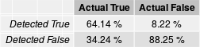

```{r setup, include=FALSE}
knitr::opts_chunk$set(echo = TRUE, warning = FALSE, message=FALSE)
```

# Abstract
<div style="text-align: justify"> 
Deforestation of the rainforest, especially in Brazil, is a recurring topic in science and public. 
Illegal deforestation is often detected far too late to prevent it.
With this work we present a reproducible approach to detect deforestation in near real time by NDVI computation of satellite imagery. 
Using appropriately cloud-adjusted and deseasonalized reference data, critical NDVI changes were calculated for past deforestation events.
Taking these values and selecting an appropriate quantile for them above which an NDVI change is considered as critical, two satellite images can be examined for deforestation.
</div>

# Introduction
<div style="text-align: justify"> 
The deforestation of the rainforest is a important topic in science and public. 
Especially due to the worsening of climate change, there are more and more calls for countries that contain large parts of the rainforest to stop deforestation. 
This is especially true for Brazil, which has the largest amount of tropical rainforest in the world, covering an area of 318,7 ha ([statista](https://de.statista.com/statistik/daten/studie/1184216/umfrage/die-zehn-laender-mit-der-groessten-flaeche-tropischer-regenwaelder/)). 
For a long time it seemed that Brazil could counteract deforestation. 
At the beginning of the 2010s, Brazil managed to reduce deforestation of the rainforest by 84 %, compared to the historic peak of 2004. 
Thus, in 2012, only 4,571 km^2^ were cut down instead of 27,772 km^2^ in 2004 ([nature ecology & evolution: The Brazilian Amazon deforestation rate in 2020 is the greatest of the decade](https://doi.org/10.1038/s41559-020-01368-x)).
However, this trend has reversed since 2013.
The Brazilian Amazon Deforestation Monitoring Program ([PRODES](http://www.obt.inpe.br/OBT/assuntos/programas/amazonia/prodes)) estimated deforestation of 11,088 km^2^ for 2020, which corresponds to the highest value for the entire decade. 
This upward trend in deforestation was triggered by changes in the Brazilian Forest Code and new laws which may allow illegally grabbed public land to be legalized ([Clarifying Amazonia's burning crisis](https://doi.org/10.1111/gcb.14872)).
Thus, illegal clearing of the rainforest, which is mostly difficult to record, occurs over and over again. 

With this work we present a tool to capture deforestation of the Brazilian rainforest in near real time by analyzing the NDVI in Landsat Data Cubes. 
Using previously collected reference data for a study area in the Brazilian Amazon, we calculate the changes in NDVI after deforestation in order to use these values for future detection of deforestation. 
By comparing the NDVI change of satellite images from two timesteps, we analyze deforestation. 
A land is identified as deforested if the NDVI decrease is over a determined threshold.
To make the satellite images usable, clouds were removed and thus missing pixel values were replaced by the observated values of future timestamps. 
In addition seasonal variations where removed, which would otherwise have disguised erroneously deforestation in the data. 
The methodology was largely taken from the paper [Monitoring Deforestation at Sub-Annual Scales as Extreme Events in Landsat Data Cubes ](https://doi.org/10.3390/rs8080651), leaving out some components that were not interesting for us and adding others that we needed, e.g. for the near real time analysis. 
In the following, we specify our used data, briefly describe the used methods as well as the results and discuss them afterwards. 
</div>

# Data
<div style="text-align: justify"> 
To perform our calculations, we chose a study area located in the northwest of Brazil (see Figure 1). 
This area is located along the border of the Brazilian states Randônia, Amazonas and bordering the Bolivian state of Pando. 
We chose this study area because it is completely covered by the area of the native rainforest and is affected by deforestation. 
The extent was chosen to be larger than the deforestation area itself, to avoid a smoothing out effect when deseasonalising the satellite data. 
To carry out our methods, two types of data were needed. 
On the one hand satellite data to calculate the NDVI and on the other hand reference data when and where specific areas were recognized as deforested. 
We need both data to inspect the NDVI change of an deforested area.
The satellite data we used are Landsat 8 data in *GeoTIFF* format in the CRS *WGS 84 / UTM zone 19N*, with a spatial extent of *[left = -7347259, right = -7314864, top = -995476.1, bottom = -1025490]* and a temporal extent of *2014-01-01* until *2019-12-31*.
The raw data is available [here](https://uni-muenster.sciebo.de/s/yvFiuWGqG7riliA/download).
In addition to the data needed to calculate the NDVI, data was also needed where deforestation had already been detected. 
We obtained these data from the PRODES program, already mentioned in the introduction. 
They publish data for the deforested areas in Brazil larger than 6.25 hectares starting from 2008. 
Wherby they consider deforestation to be the suppression of native vegetation, regardless of the future use of these areas.
We have downloaded the corresponding data as shapefiles ([TerraBrasilis catalogue](http://terrabrasilis.dpi.inpe.br/geonetwork/srv/eng/catalog.search#/metadata/b75b83db-8026-43f9-9537-ee1dfa308158)). 

<p align="middle">
<font size="4">**Figure 1: Study Area**</font>
</p>
<p align="middle">
  
</p>
</div>

# Methods 
<div style="text-align: justify"> 
As already briefly mentioned in the introduction, the basic idea of our approach comes from the paper [Monitoring Deforestation at Sub-Annual Scales as Extreme Events in Landsat Data Cubes ](https://doi.org/10.3390/rs8080651). 
Their basic idea was to divide an NDVI image time series into a reference cube and a monitoring cube.
The reference cube contains historical observations where non-forest pixels have been masked, and the monitoring cube contains newly acquired observations, not yet assessed for deforestation. 
Based on training data and observations in the reference cube a threshold quantile for defining an observation as abormally low was calculated and applied for each pixel value in the monitoring cube. 
If the pixel is below the threshold quantile, the pixel is flagged as deforested. 
We adopted this basic idea and also carried out usual preparatory steps, such as a filling of cloud gaps and a deseasonalization of the data.  

First, both the reference data and satellite images must be converted into a format that we can use. 
To start with the reference data, we loaded the data from PRODES into [QGIS](https://qgis.org/en/site/) to prepare it accordingly. 
We changed the coordinate reference system from *SIRGAS 2000* to *WGS 84 / UTM zone 19N* as our satellite data were already delivered in this format.
Since the data were always available for individual days, we have combined them into months.
As can be seen [here](https://github.com/tnier01/MonitoringDeforestationInLandsatDataCubesUsingNDVI/tree/main/data/deforestation), the data were ultimately available in this monthly format for four to 9 months, and predominantly in the second half of the year. 
The PRODES data are shapefiles, and were thus converted into the raster format which is also used for our satellite data. 
The last step was to crop the data to the study area described above. 
Similar steps that were performed for the PRODES data in QGIS, were performed for the satellite data in R using [gdalcubes](https://cran.r-project.org/package=gdalcubes). 

We split the satellite images in a reference time series with a temporal extent from 2014 to 2018 and a monitoring time series with a temporal extent for 2019.
Therefore we [create](https://rdrr.io/cran/gdalcubes/man/cube_view.html) gdal cubes. 
With the help of a mask, only those pixels are considered that are either clear or water in order to avoid calculation difficulties caused by clouds (see Figure 2). 
For the reference time series, two data cubes are created, one with a spatial resolution of 250 m (for the calculation of the NDVI) and one with a spatial resolution of 1000 m (for the deseasonalization of the data). 
With the creation of the data cubes, the spatial extent is set to the study area, the temporal extent is limited to the above mentioned dates, whereby the size of of pixels in time-direction is about one month.
Then the NDVI is calculated for the data cubes (see Figure 3.1). 
Using a mask to consider only cloud-free pixels inevitably results in pixels with not available values (na-values) that are not of the two selected classes for the mask.
In order to still be able to perform our methods, these na-values must be filled. 
To do this, we [fill](https://rdrr.io/cran/gdalcubes/man/fill_time.html) these pixels with the next pixel that is available of the next observation carried backward in time (see Figure 3.2). 
We have deliberately chosen to fill with pixels that are in future time steps, as otherwise the deforestation could be temporarily obscured. 
In the following the NDVI images are spatially normalised to reduce saisonality (see Figure 3.3). 
Based on the justification mentioned in the paper [Monitoring Deforestation at Sub-Annual Scales as Extreme Events in Landsat Data Cubes ](https://doi.org/10.3390/rs8080651) we divide for each time step each pixel value by the 0.95 NDVI quantile of all pixel values of one time step.
 
```{r, echo=FALSE, fig.align = 'center'}
library(raster)
library(rasterVis)

raw1 = raster("exampleImages/Raw_Blue_2016-04.tif")
raw2 = raster("exampleImages/Raw_Green_2016-04.tif")
raw3 = raster("exampleImages/Raw_Red_2016-04.tif")
raw = stack(raw1, raw2, raw3)

plotRGB(raw, r=3, g=2, b=1, zlim=c(0, 1500), scale=1500, axes=TRUE, main='Figure 2: Initial Landsat-8 Data After Masking')
 
#r1 = raster("exampleImages/Raw_2016-04.tif")
r1 = raster("exampleImages/NDVIraw_2016-04.tif")
r2 = raster("exampleImages/NDVIFilled_2016-04.tif")
r3 = raster("exampleImages/NDVIDes_2016-04.tif")

s = stack(r1, r2, r3)
levelplot(s, scales=list(draw=FALSE), names.attr=c('Figure 3.1: NDVI Raw', 'Figure 3.2: NDVI Filled', 'Figure 3.3: NDVI Deseasonalized'), main='Figure 3: NDVI Data at Different Preprocessing Stages')
```

With the previous mentioned steps, the satellite data were adequately prepared to examine how the NDVI has changed in relation to a deforestation event. 
For this purpose, we calculate for our reference time series the NDVI before and after a deforestation event. 
For each month in which a deforestation event was detected on the basis of the PRODES data, the NDVI of the previous month and the following month are examined and substracted from each other. 
We have decided to use the previous month and the following month because we have prepared all data in a monthly format and thus it is the best possible comparison in terms of accuracy. 
For all time steps, and thus for each pixel that was affected by deforestation, we store the difference of the NDVI for this pixel from the previous month and the following month. 
This gives us a list of critical NDVI changes that potentially imply a deforestation event. 

The list of critical values is then used to search for deforestation in the monitoring time series. 
Like in the paper [Monitoring Deforestation at Sub-Annual Scales as Extreme Events in Landsat Data Cubes ](https://doi.org/10.3390/rs8080651), we also use the extreme value approach. 
With this approach, deforestation observations, that we have collected in the previous mentioned list are regarded as abnormally high, if they are above a specific quantile. 
Thus, if the difference between two pixels of two subsequent time steps in the monitoring cube is above a certain quantile of the values of our list, the pixel is considered as deforested.
Our script is designed in such a way that the specific quantile can be changed and thus the results of the potentially deforested area change accordingly. 
To make this changeability of our methodology easily applicable and visible to everyone, we are making this research available as an [Executable Research Compendium (ERC)](https://o2r.info/erc-spec/spec/#erc-specification).
The corresponding ERC can be changed via the *MANIPULATE* menu item.
In this way, the quantile at which a NDVI change is considered deforested can be changed interactively as binding and a map showing the deforested areas will change accordingly. 
The example given in the ERC also includes a table for evaluation. 
For the monitoring cube used by us, it is checked whether the detected deforestation has really taken place, i.e. whether it has also been detected by PRODES. 
For this purpose, the difference for the NDVI in one month and the second following month was again calculated in the monitoring cube. 
If a deforestation event was reported by PRODES in the intervening month, the detection on basis of the NDVI is considered correct. 
The table thus interactively displays the percentage of correctly recognized and incorrectly recognized values in relation to the currently choosen quantile. 
</div>

# Results 
<div style="text-align: justify"> 
With our work we achieved different results - how the NDVI changes by deforestation, predictions of deforestation and an ERC.

The calculated NDVI changes are visual in Figure 4. 
The mean decrease of the NDVI is 0.11 with a standard deviation of 0.13.
For this data we calculated the 0.1 and 0.3 quantile. 
For the 10% quantile we have the value -0.30, which means that 10% of the changes are below -0.3.
For the 30% quantile we get the value -0.15.

```{r, fig.align = 'center', echo=FALSE}
load("data/NDVIchanges.Rdata")
hist(changes, main='Figure 4: NDVI Changes Depending on Their Frequency', xlab='NDVI Changes', ylab="Frequency")
```

Now we know the critical values.
The next step is to calculate the change in the NDVI values. 
In Figure 5 you can inspect how the NDVI value changed. 
We can inspect that the NDVI styed the same in the most of the areas. 
However, we can inspect irregular patches with a decrease of the NDVI around 0.3. 
In this area the NDVI decreases, which means that there is a loss of vegetation, so this area may be deforested.
```{r, out.width=600, echo=FALSE, fig.align = 'center'}
# Detect deforestation on a added month

# set variables
percentage= 0.1 # the quantile of reference data which should be used to detect deforestation
newMonth= "2019-09" # the month which should be proofed. Month must be deaseasonalized and saved. This can be ideally done by the PreprocessingMonitoringCube.Rmd file.

load("data/NDVIchanges.Rdata")

library("lubridate")
library("raster")

#calculate the NDVI decrease value at which we predict a deforestation
criticalValue=quantile(changes, percentage)

#Select NDVI values from 2 month ago, to detect changes
dat = as.Date(paste(newMonth,"-01",sep=""))
d1= dat%m-% months(2)
oldMonth = format(d1, "%Y-%m")

newFilename= paste0("data/MonitoringDeseasonalized/Norm_", newMonth ,".tif")
rasterNew= raster(newFilename)
oldFilename= paste0("data/MonitoringDeseasonalized/Norm_", oldMonth ,".tif")
rasterOld= raster(oldFilename)


# calculate the NDVI change
NDVIchange= rasterNew-rasterOld
plot(NDVIchange, main = "Figure 5: NDVI Change from 07/2019 to 09/2019")  
```

If we detect areas where the NDVI decrease is below our two critical values -0.3 and -0.15 we end up with the two maps (see Figure 6.1 and 6.2).
The blue color indicates a possible deforestation. 
For the -0.3 value often only small patches are indicated. 
For -0.15 this detected patches mostly only get bigger. 
As expected also more pixels were indicated as possible deforested. 
However, there are also some new areas classified as deforested. 
For example in the west south-west of the area. 

<table style="width:100%">
  <tr>
    <th style="text-align: center">Figure 6.1: Detected Deforestation <br> with 0.1-Quantile</th>
    <th style="text-align: center">Figure 6.2: Detected Deforestation <br> with 0.3-Quantile</th>
    <th style="text-align: center">Figure 6.3: Observed Deforestation <br> in 08/2019</th>
  </tr>
  <tr>
    <td style="text-align: center"></td>
    <td style="text-align: center"></td>
    <td style="text-align: center"></td>
  </tr>
</table>

To evaluate our detection we compared the detection with reference data of actual deforestation for August 2019 (see Figure 6.3).
We then calculated four different values. 
First we counted the pixels where we detected deforestation and really deforestation was and furthermore where deforestation was, but we have not detected it. 
To make the values better to understand we divided them through the count of pixels actual deforested. 
For the next two values, we counted, where we have not detected deforestation and deforestation was or was not. 
These values were again divided by the count of not actual deforested pixels.
The results are displayed in Figure 7.1 and 7.2.

<table style="width:100%">
  <tr>
    <th style="text-align: center">Figure 7.1: Evaluation with 0.1-Quantile</th>
    <th style="text-align: center">Figure 7.2: Evaluation with 0.3-Quantile</th>
  </tr>
  <tr>
    <td style="text-align: center"></td>
    <td style="text-align: center"></td>
  </tr>
</table>
<br> 

With the quantile value of 0.1, we detected 33.6 % of the deforested area.
We have not detected 65.8 % of the deforested area. 
Furthermore, 1.9 % of the not deforested area was falsely classified as detected. 
To compare this with the quantile value of 0.3, we detected around 30 % more of the deforested area, so only 34.2 % was not detected. 
However, then was 8.2 % area falsely detected as deforested.

In this article we just compare the two quantiles 0.1 and 0.3. 
A further result of our work is an Executable Research Compendium (ERC). 
The user can here rebuild the HTML and proof if our results are reproducible. 
Furthermore, the users can change the percentile by themselves. 
Therefore, they can inspect which effect a change of the quantile has on the detection and the precision of the detection. 
The users can evaluate which quantile fits best for their purposes.
</div>

# Discussion 
<div style="text-align: justify"> 
In this section, we will discuss the results we have obtained and address particularities and limitations. 

In the Figure 7.1 and 7.2, we can see that a change in the quantile has quite a huge impact on the precision of the detection.
If we change the quantile form 0.1 to 0.3 we inspect a high increase in the correct detection. 
This shows that we are getting more precise in the correct detection of deforested areas. 
However, also the number of incorrect detections increase. 
Since the non deforested area is quite higher than the deforested area this percentage means a bigger area than the other percentage. 
The different quantiles are useful for different cases.
On the one hand, if we want to get a detailed area where deforestation happens, a high quantile is good, because the percentage detects all deforested area.
On the other hand, if we want to detect where illegal deforestation happened, we should use a smaller quantile to not detect false areas.
Especially, we can inspect on the maps that the area of deforestation is mostly detected correctly. 
Then this area can be inspected in more detailed, but no time is wasted with detection where no decrease was.
The users have to decide on their own what their priorities are, a high detection or a small false detection rate. 

With the presented approach we demonstrate a way how deforestation can be detected using spatiotemporal methods. 
In doing so, we use both temporal methods, such as filling cloud gaps, and spatial methods, such as deseasonalizing, to prepare the data. 
Besides traditional methods like deforestation detection by unsupervised/ supervised classification, or even algorithms like [BFAST](https://bfast.r-forge.r-project.org/), detection by a NDVI threshold like we used shows an similar effective method to detect deforestation. 
In addition to our preprocessing steps of cloud removal and deseasonalizing, other methods would certainly have been conceivable, such as topographic correction and atmospheric correction, which can be performed e.g. using the processing engine [FORCE](https://github.com/davidfrantz/force). 
However, it must always be considered individually how effective and useful certain preparatory steps are.  

The initial idea for this work, was to reproduce the paper [Monitoring Deforestation at Sub-Annual Scales as Extreme Events in Landsat Data Cubes ](https://doi.org/10.3390/rs8080651). 
However, this approach was limited by the fact that it was not possible to establish contact with the authors.
Thus corresponding data were not available.
Although the methods used were available in a more advanced version in the form of the package [STEF](https://github.com/hamun001/STEF), they were not directly reproducible for us. 
Due to this limitation and the project scope, we decided to reproduce just the main methodology of the paper.
Compared to the paper, we do not double-check deforestation over two observations. 
Although this can increase the error rate for incorrectly detected deforestation, e.g. caused by cloud shadows or naturally low values, a faster detection is possible, which was the goal of our work.
Furthermore pixels were excluded from observations as soon as they were detected as deforested in the paper. 
We have deliberately decided to continue to observe all pixels also after deforestation, since repeated deforestation, e.g. after reforestation, is also possible. 
Moreover we have decided to make our research work available as an ERC, in order to achieve higher reproducibility and comparability.
 
Besides the differences to the paper, there were some other limitations. 
For the datacubes a lower resolution in general, especially for the deseasonalization, was necessary due to lack of computer power. 
Sometimes only parts of the pixels are deforested, so the NDVI change of the pixel is not that high. 
Our pixel size does not capture these differences, this would only be possible with smaller pixels, and thus more precise NDVI values.  
While this can lead to problems with small areas of deforestation, the general goal is not to detect the total area of deforestation but to detect deforestation in general. 
Thus, as soon as deforestation has been detected at a location, it can still be checked whether illegal deforestation has occurred. 
Moreover, due to the limited computer power, we were not able to use gdalcubes for all methods and used the package [raster](https://cran.r-project.org/web/packages/raster/raster.pdf) in some cases, as calculations were repeatedly cancelled using gdalcubes. 
Nevertheless, it was of great advantage to use gdalcubes especially for preparation and unification of the satellite data. 
It should also be noted that the reference data from PRODES were only available for certain months and in these months only partially for our study area. 
However, these are verified data in large numbers that could not have been created or collected by us, or only with a great deal of effort. 

# Conclusion
This work shows a reproducible approach how deforestation can be detected in near real time based on NDVI calculations of satellite imagery. 
Using appropriately prepared reference data, critical NDVI changes were calculated for past deforestation events. 
Taking these values and selecting an appropriate quantile for them above which an NDVI change is considered as critical, two satellite images can be examined for deforestation.
The quantile can be individually adjusted and thus adapted to the study area currently under consideration.  
Despite the limitations, this approach offers an effective way to detect the resurgence of deforestation in areas such as the Brazilian rainforest at an early stage. 

*This work was done entirely in peer programming by the two team members, Nick Jakuschona and Tom Niers.* 
</div>

