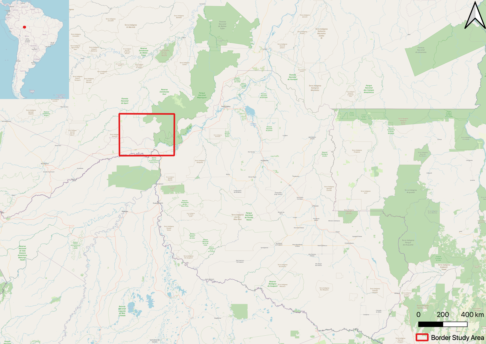

```{r setup, include=FALSE}
knitr::opts_chunk$set(echo = TRUE)
```

# requirements
- 5 pages excluding figures and tables 

# titel 
Monitoring Deforestation In Landsat Data Cubes Using NDVI

# Abstract

# Introduction wie
<div style="text-align: justify"> 
The deforestation of the rainforest is a important topic in science and public. 
Especially due to the worsening of climate change, there are more and more calls for countries that contain large parts of the rainforest to stop deforestation. 
This is especially true for Brazil, which has the largest amount of tropical rainforest in the world, covering an area of 318,7 ha ([statista](https://de.statista.com/statistik/daten/studie/1184216/umfrage/die-zehn-laender-mit-der-groessten-flaeche-tropischer-regenwaelder/)). 
For a long time it seemed that Brazil could counteract deforestation. 
At the beginning of the 2010s, Brazil managed to reduce deforestation of the rainforest by 84%, compared to the historic peak of 2004. 
Thus, in 2012, only 4,571 km^2^ were cut down instead of 27,772 km^2^ in 2004 ([nature ecology & evolution: The Brazilian Amazon deforestation rate in 2020 is the greatest of the decade](https://doi.org/10.1038/s41559-020-01368-x)).
However, this trend has reversed since 2013.
The Brazilian Amazon Deforestation Monitoring Program ([PRODES](http://www.obt.inpe.br/OBT/assuntos/programas/amazonia/prodes)) estimated deforestation of 11,088 km2 for 2020, which corresponds to the highest value for the entire decade. 
This upward trend in deforestation was triggered by changes in the Brazilian Forest Code and new laws which may allow illegally grabbed public land to be legalized ([Clarifying Amazonia's burning crisis](https://doi.org/10.1111/gcb.14872)).
Thus, illegal clearing of the rainforest, which is mostly difficult to record, occurs over and over again. 

With this work we present a tool to capture deforestation of the Brazilian rainforest in near real time by analyzing the NDVI in Landsat Data Cubes. 
Using previously collected reference data for a study area in the Brazilian Amazon, we calculate the changes in NDVI after deforestation in order to use these values for future detection of deforestation. 
By comparing the NDVI change of satellite images from two timesteps, we analyze deforestation. 
A land is identified as deforested if the NDVI decrease is over a determined threshold.
To make the satellite images usable, clouds were removed and thus missing pixel values were replaced by the observated values of future timestamps. 
In addition seasonal variations where removed, which would otherwise have disguised erroneously deforestation in the data. 
The methodology was largely taken from the paper [Monitoring Deforestation at Sub-Annual Scales as Extreme Events in Landsat Data Cubes ](https://doi.org/10.3390/rs8080651), leaving out some components that were not interesting for us and adding others that we needed, e.g. for the near real time analysis. 
In the following, we specify our used data, briefly describe the used methods as well as results and discuss them afterwards. 
</div>

# Data
<div style="text-align: justify"> 
To perform our calculations, we choose a study area located in the northwest of Brazil. 
This area is located along the border of the Brazilian states Randônia, Amazonas and bordering the Bolivian state of Pando (compare Figure TODO). 
We choose this study area because it is completely covered by the area of the native rainforest and is also affected by deforestation. 
The extent was chosen to be larger than the deforestation area itself, to avoid a smoothing out effect when deseasonalising the satellite data. 
To carry out our methods, two types of data were needed. 
On the one hand satellite data to calculate the NDVI and on the other hand reference data when and where specifc areas were recognized as deforested. 
We need both data to inspect the NDVI change of an deforested area.
The satellite data we used are Landsat 8 data in *GeoTIFF* format in the CRS *WGS 84 / UTM zone 19N*, with a spatial extent of *[left = -7347259, right = -7314864, top = -995476.1, bottom = -1025490]* and a temporal extent *2014-01-01* until *2019-12-31*.
The raw data is available ([here](https://uni-muenster.sciebo.de/s/yvFiuWGqG7riliA/download)).
In addition to the data needed to calculate the NDVI, data was also needed where deforestation had already been detected. 
We obtained these data from the PRODES program, already mentioned in the introduction. 
They publish data for the deforested areas in Brazil larger than 6.25 hectares starting from 2008. 
Wherby they considers deforestation to be the suppression of native vegetation, regardless of the future use of these areas.
We have downloaded the corresponding data as shapefiles ([here](http://terrabrasilis.dpi.inpe.br/geonetwork/srv/eng/catalog.search#/metadata/b75b83db-8026-43f9-9537-ee1dfa308158)). 

<p align="middle">
  
</p>
</div>

# Methods 
<div style="text-align: justify"> 
As already briefly mentioned in the introduction, the basic idea of our approach comes from the paper [Monitoring Deforestation at Sub-Annual Scales as Extreme Events in Landsat Data Cubes ](https://doi.org/10.3390/rs8080651). 
Their basic idea was to divide an NDVI image time series into a reference cube and a monitoring cube.
The reference cube contains historical observations where non-forest pixels have been masked, and the monitoring cube contains newly acquired observations, not yet assessed for deforestation. 
Based on training data and observations in the reference cube a threshold percentile for defining an observation as abormally low was calculated and applied for each pixel value in the monitoring cube. 
If the pixel is below the threshold percentile, the pixel is flagged as deforested or potential deforested. 
We adopted this basic idea and also carried out usual preparatory steps, such as a filling of cloud gaps and a deseasonalization of the data.  

First, both the reference data and satellite images must be converted into a format that we can use. 
To start with the reference data. The data was loaded from PRODES into [QGIS](https://qgis.org/en/site/) to prepare it accordingly. 
We changed the coordinate reference system from SIRGAS 2000 to EPSG:3857 - WGS 84/ Pseudo-Mercator for these reference data as our satellite data were already in this format.
Since the data were always available for individual days, we have combined them into months.
As the PRODES data are shapefiles, they were converted into the raster format which is also used for our satellite data. 
The last step was to crop the data to the study area described above. 
Similar steps that were performed for the PRODES data in QGIS, were performed for the satellite data in R using [gdalcubes](https://cran.r-project.org/package=gdalcubes). 

We split the images in a reference time series with a temporal extent from 2014 to 2018 and a monitoring time series with a temporal extent for 2019.
Therefore we [create](https://rdrr.io/cran/gdalcubes/man/cube_view.html) gdal cubes. 
With the help of a mask, only those pixels are considered that are either clear or water in order to avoid calculation difficulties caused by clouds. 
For the reference time series, two data cubes are created, one with a spatial resolution of 250m for the calculation of the NDVI and one with a spatial resolution of 1000m for the deseasonalization of the data. 
This lower resolution in general but especially for the deseasonalization was necessary due to lack of computer power. 
With the creation of the data cubes, the spatial extent is set to the study area, the temporal extent was limited to the above mentioned dates, whereby the size of of pixels in time-direction was about one month.  
Then the NDVI is calculated for the data cubes. 
Using a mask to consider only cloud-free pixels inevitably results in pixels with na values that are not of the two selected classes for the mask.
In order to still be able to perform our methods, these na values must be filled. 
To do this, we [fill](https://rdrr.io/cran/gdalcubes/man/fill_time.html) these pixels with the next pixel that is available of the next observation carried backward. 
We have deliberately chosen to fill with pixels that are in the future, as otherwise the deforestation could be temporarily obscured. 

In the following the NDVI images are spatially normalised to reduce saisonality. 
Based on the justification from the paper [Monitoring Deforestation at Sub-Annual Scales as Extreme Events in Landsat Data Cubes ](https://doi.org/10.3390/rs8080651) we divide for each time step each pixel value by the 0.95 NDVI quantile of the whole time step.
 


```{r}
library(raster)
library(rasterVis)

r1 = raster("exampleImages/Raw_2016-04.tif")
r2 = raster("exampleImages/NDVIraw_2016-04.tif")
r3 = raster("exampleImages/NDVIFilled_2016-04.tif")
r4 = raster("exampleImages/NDVIDes_2016-04.tif")

s = stack(r1, r2, r3, r4)
levelplot(s, scales=list(draw=FALSE), names.attr=c('Raw', 'NDVI Raw', 'NDVI Filled', 'NDVI Deseasonalized'))
```

<p align="middle">
  
   
  
  
</p>


</div>


- und dann Schritt für Schritt Skripte und Methoden in R 
- comparison as binding 

# results 
With our work we archived different Results.
First we calculated how the NDVI change of a deforested region from 2014 to 2018. 
With this data we can calculate a percentile, at which 
```{r}
load("data/NDVIchanges.Rdata")
hist(changes)

```
- über false postive... berichten 
- was passiert wenn man das quantile verändert 

# discussion/ conclusion
- durchaus sagen wechsel zwischen gdalcubes und nur raster 
- Unterschiede paper wir 
- erklären das unsere großen pixel 250 dazu führen das wir die deforestation zwar punktuell erkennen die Prozentzahlen aber wegen der hohen Größe eher gering bleiben
- methods should be discussed in the context of simpler and more complex alternatives 
- describe the methods in context of spatio temporal (Ideally, the methods assessed should be spatiotemporal, i.e. deal with spatial and temporal variation at the same time, but, as we have seen, this is often difficult. If the methods assessed are purely spatial, or purely temporal, try to discuss them in the light of spatiotemporal alternatives.). 
- who did what? 
- was zum ERC schreiben auch den Aspekt erwähnen, dass wir eigentlich das Paper ja reproduzieren wollten, ging aber nicht aufgrund fehlender Rückmeldung etc. daher wollen wir es nun besser machen

# references 